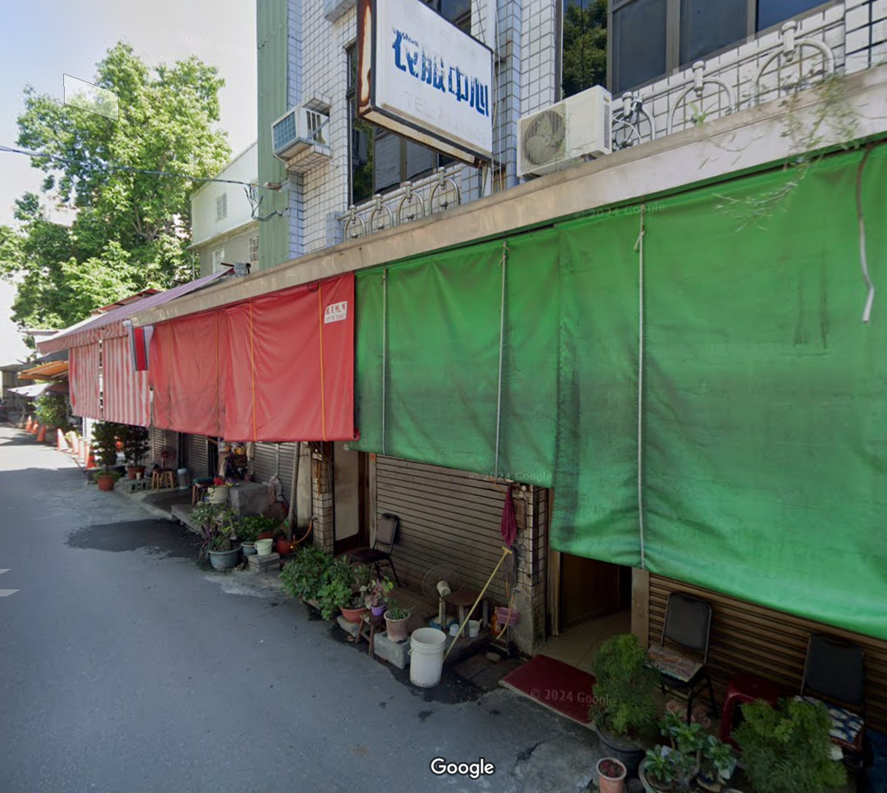
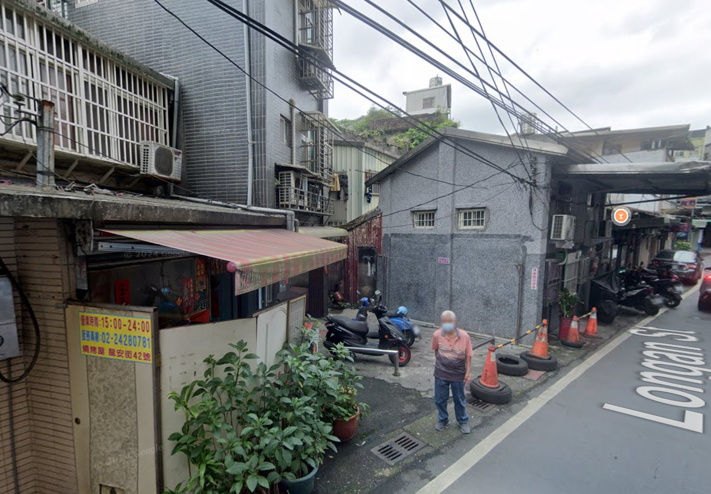
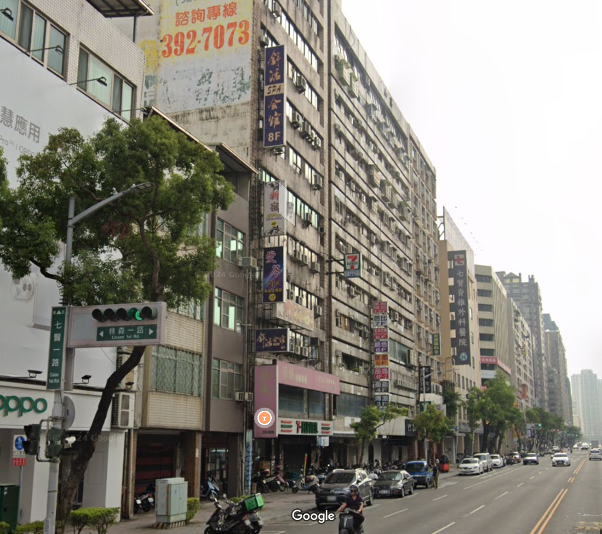
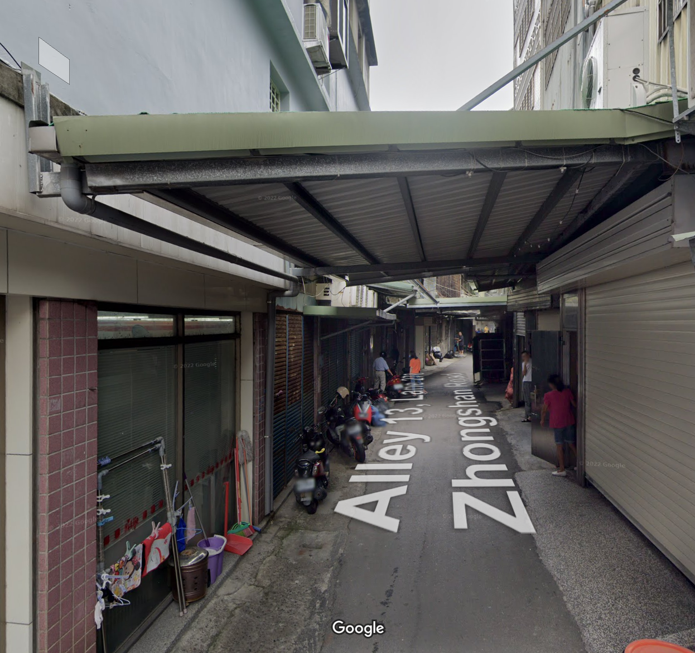
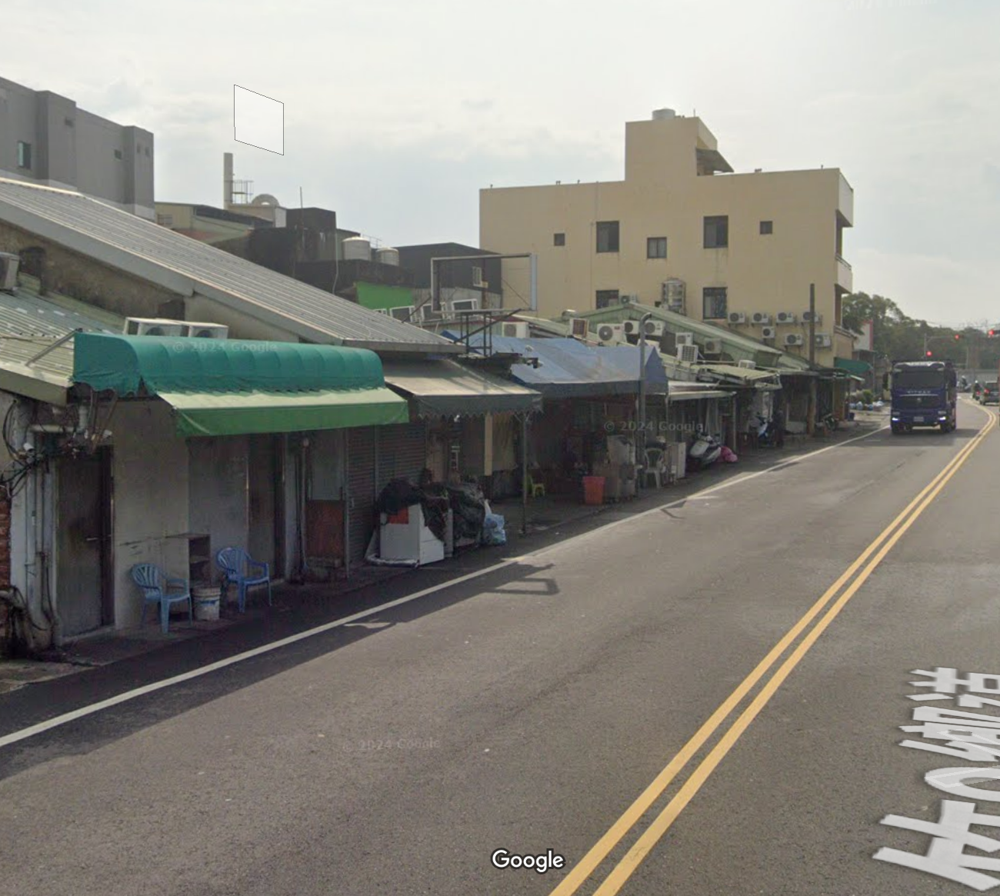

## About this site {width="20%",height="10%"}

專注在空間資訊的研究者 支持專區的成立

經過全台的盤點及調查我們可以大致觀察到以下的現象特徵:

## 阿公店的分布特徵 {width="80%",height="90%"}

### 公園型 {width="20%", height="300px"}

[公園型]{.highlight-pink}

首先是阿公店不知道為甚麼總是出現在公園旁邊，原因可能是公園是人們休閒的場所，阿公店提供了社交和放鬆的空間，吸引了許多老年人和工人階層前來聚集      

#### 

`萬華艋舺公園` / `台中公園` / `高雄鳳山`

{width="411"}

### 鐵支路型 {width="20%", height="300px"}

[鐵支路型]{.highlight-pink}

會群聚在鐵道附近理由可能是，鐵道旁一般人比較不容易行經也較為隱蔽，而且離車站不遠交通便利         

#### 

`雲林虎尾鐵支路` / `基隆龍安路` / `台南新營糖廠`

{width="411"}

### 住商大樓 {width="20%", height="300px"}

[住商大樓]{.highlight-pink}

再來則是馬路邊或是騎樓，由於交通方便，且會去這種店的客人許多為工人階層        

#### 

`高雄的電信大樓` / `高雄九如路`

{width="411"}

### 傳統豆干厝 {width="20%", height="300px"}

[傳統豆干厝]{.highlight-pink}

最後則是傳統的豆干厝，這類店家通常會在巷弄內，可能會在軍營、暗巷或是鐵皮屋旁，且客人多為熟客， 環境較為簡陋    

#### 

`西勢美豆干厝` / `萬華西園路巷弄的阿公店` / `桃園中壢的三仙巷` / `屏東榮民之家` / `台中豐原`

{width="411"}

### 工廠違建型 {width="20%", height="300px"}

[工廠違建型]{.highlight-pink}

這類店家通常會在工業區或是工廠附近，可能會在工業區的違建或是工廠的後門，且客人多為工人階層， 但根據理論來說此種區位最不適合開設阿公店，因為工業區的治安較差，晚上大家都下班回家，逗留在那裏 容易形成治安死角，沒有人可以保證你的安全

#### 

`桃園中壢的雙連坡` / `新竹榮光路上` / `彰化花壇鄉(已關閉)`

{width="411"}

## 阿公店的分布特徵 {width="80%", height="90%"}

### 結論 {width="20%", height="300px"}

[結論]{.highlight-conclusion}

這些阿公店的分布特徵顯示出它們與周圍環境的密切關聯，無論是公園、鐵道、住商大樓還是傳統豆干厝，都反映了社區文化和生活方式的多 樣性。這些店家不僅是社交場所，也是地方文化的一部分，承載著歷史和人情味。 但是有幾點必須要多加注意，根據珍雅各的理論其實專區應該設置在越熱鬧的地區，走在路上有路人幫忙監視起到鄰里 守望的作用，以保護顧客的安全，然而這些阿公店大多數都設置在偏僻的巷弄或是工業區，這樣的區位選擇可能會 導致治安問題，尤其是在夜晚時分，缺乏人流和監視可能會增加犯罪風險。對雙方都會造成困擾，顧客可能會因為安全問題而不願意光顧，而店家則可能面臨治安風險和經營困難。

### 最佳區位 {width="20%", height="300px"}

[最佳區位]{.highlight-best} 商業區但不應過於繁忙只要存在部分人流就好，顧客也希望有隱蔽性

### 最差區位 {width="20%", height="300px"}

[最差區位]{.highlight-worst} 工業區、農業區，首先是居民多半無意願，也對生活造成困擾，其次由於地處偏僻對雙方而言無法保障人身安全， 尤其夜間燈光極度昏暗，容易產稱治安問題。

###  {width="100%"}

<iframe src="台灣阿公店2.html" width="100%" height="400">

</iframe>

<iframe width="70%" height="400" src="https://www.youtube.com/embed/AxDDhuGO0Uk?si=o1NigivD5ii87rjw" title="YouTube video player" frameborder="0" allow="accelerometer; autoplay; clipboard-write; encrypted-media; gyroscope; picture-in-picture; web-share" referrerpolicy="strict-origin-when-cross-origin" allowfullscreen>

</iframe>

## 

### {width="20px", height="300px"}

每種場域存在地域性，因此才會出現 北中南東各有不同的特質， 認為顧客會傾向選擇離家較近的店家，這樣可以節省時間和交通成本，並且更容易形成穩定的客源。

### {width="20%", height="300px"}

[參考文獻]{.highlight-pink}

### {width="20%", height="300px"}

-   

    1.  [珍雅各的理論](https://www.jenjacobs.com/)

-   

    2.  [樓鳳，性淘金產業大揭密：警察帶路，立馬看懂江湖規矩，菜雞一夜成為老司機，乖乖女聽懂所有men’s talk](https://www.books.com.tw/products/0010883530?srsltid=AfmBOoqeGkS03PQ8QHL9cE0DbRDQLSBy0Beu6IC0FuvwhIxWqX0IOnzO)

-   

    3.  [我在荷蘭當都更說客：阿姆斯特丹以人為本的10年街區再生筆記](https://www.books.com.tw/products/0010980610?srsltid=AfmBOopdZPDPX5jn5Hzo8Vv5Yd8A-iN2KrSuK2os4rJ_3N_qQUuNAM-S)

-   

    4.  [手槍女王 HAND JOB QUEEN：一個從業職人的真情告白](https://www.books.com.tw/products/0010895473?srsltid=AfmBOoomqT6N7YNNpKQSkCkJa-MTKilDnJqIFqcK8_42JwBUHwhE3eBD)

-   

    5.  [A Network Approach to Examine Neighborhood Interdependence Through the Target Selection of Repeat Buyers of Commercial Sex in the United States](https://www.tandfonline.com/doi/full/10.1080/01639625.2022.2110542#abstract)

-   

    6.  [Where and why do illicit businesses cluster? Comparing sexually oriented massage parlors in Los Angeles County and New York City](https://pubmed.ncbi.nlm.nih.gov/32982037/)

-   

    7.  [Why are You Here? Modeling Illicit Massage Business Location Characteristics with Machine Learning](https://www.tandfonline.com/doi/full/10.1080/23322705.2021.1982238#abstract)

-   

    8.  [What makes neighbourhood-level commercial centres attractive for neighbourhood residents?](https://www.tandfonline.com/doi/full/10.1080/21681376.2024.2334057?src=recsys#d1e137)

-   

    9.  [The Red-Light Network: Exploring the Locational Strategies of Illicit Massage Businesses in Houston, Texas](https://www.tandfonline.com/doi/full/10.1080/23754931.2018.1425633?src=recsys)
