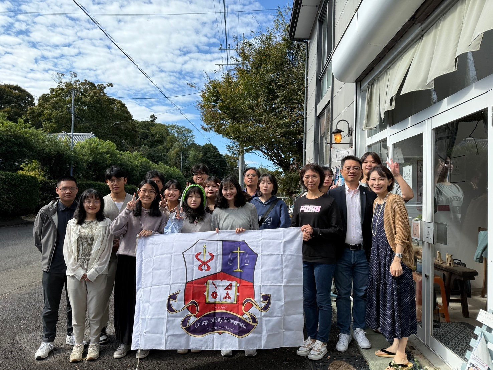
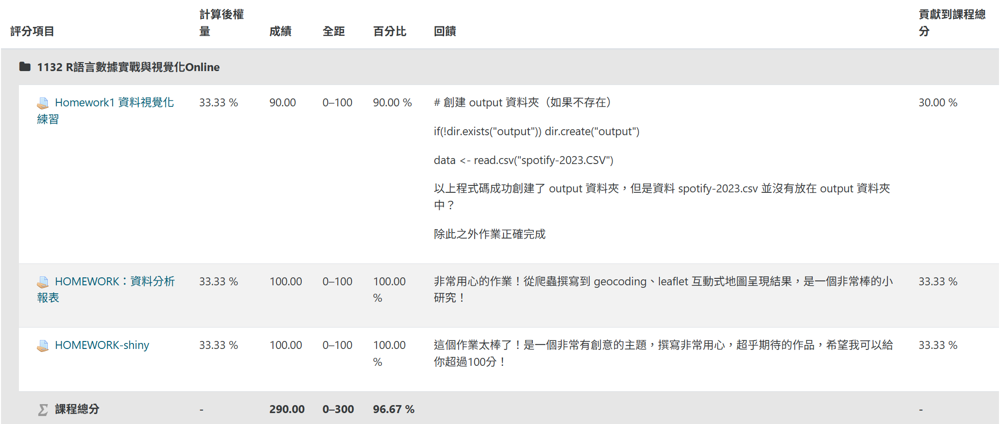

## 獎項

臺北市立大學城發系 :  🏅 校內書卷獎 111-2 、 112-1 、 113-2 學期  🏅 2023全國大觀盃尋秘北海岸 好「石」在ta pin 銀獎  🏅 北市大創新創業競賽第二名  🏅 臺北市政府青年局公共政策創意提案暨辯論競賽入圍決賽  🏅 台北探索校內專題獲得一萬元獎學金

## 證照

📑 多益金色證書 860   📑 CASA 資料科學專業能力認證通過

## 工作經歷

💼 台北市住宅及都市更新中心實習生 112年7\~8月  - 協助都市更新相關資料整理  - 協助召開南機場都市更新案說明會

💼 自強工程顧問有限公司實習生 114年7\~8月  - CAD地形圖轉換GIS之詮釋資料  - 協助GIS空間資料處理  - 參與1:1000墾丁國家公園地形圖採購案調繪初編

## 活動參與

中研院人社中心的「Cloud Computing and 3D Mapping with Geemap and Leafmap Workshop」工作坊  第六屆國土空間圖資GIS競賽研習活動

## 國際交流

日本筑波移地教學規劃工作坊

 {width="500"}
 

## 已修習之空間資訊課程

### 台大計算機網路中心 R語言視覺化

我在當中學到了R語言的各種套件以及數據清理分析的方法，更重要的是 學習到了爬蟲知識，讓資料的取得功力更上層樓。

[台大計算機網路中心 R語言視覺化](https://www.csie.ntu.edu.tw/~r96002/courses/2023-2/)

### 地理資訊系統

ARCGIS、QGIS

### 衛星遙測學

GOOGLE EARTH ENGINE

## 已修習之統計應用課程

### 統計學、大數據分析、計量地理 
SPSS、EXCEL

## 台北探索校內專題

{width="586"}

[應用GIS探討不同社會經濟族群的空間不平等 — 以公園用地為例](https://utsus.utaipei.edu.tw/p/404-1112-119743.php?Lang=zh-tw) </iframe>

## 北市大創新創業競賽第二名

建構納博聚思空間不動產資訊整合平台創業提案，本次提案結合了不動產、空間資訊， 透過串接後端API實現環域分析，透過open street map提供豐富之POI地理資訊，並結合前端網頁設計， 提供使用者友善的操作介面，讓使用者能夠輕鬆查詢鄰里相關資訊。   [{width="586"}](https://neighborgis.hazelnut-paradise.com/)

[網站連結](https://neighborgis.hazelnut-paradise.com/)

## 台北生命故事暨健康科技園區

（臺北市政府青年局113年度公共政策創意提案暨辯論競賽）入圍決賽



## 萬華茶室老街再生計畫

2024年電腦輔助設計之寒假作業。由於茶室文化老街的興衰，有感於此特別保留西園路之巴洛克式街廓， 讓老街的傳統風華再現，參照實際街景製作而成 

## 校內活動

擔任城發系學會教學組講師，負責教學弟妹PS、AI、QGIS等軟體操作，並自製教材，協助學弟妹提升設計技能。 點擊這裡查看更多：

<iframe src="QGIS advance-1.html" zoom=-50 width="100%" height="550px">
