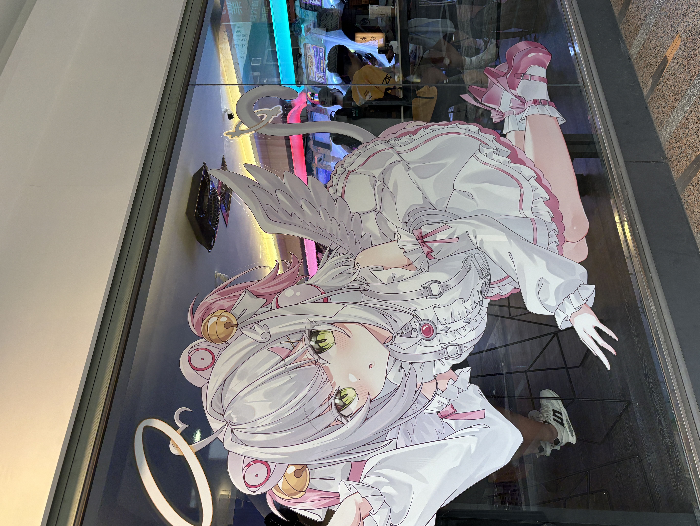
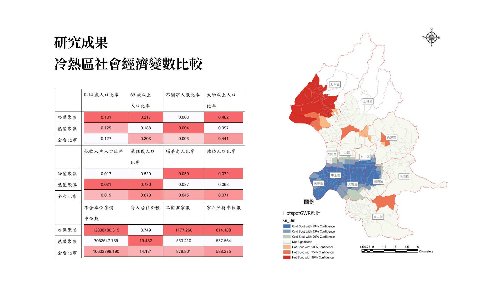
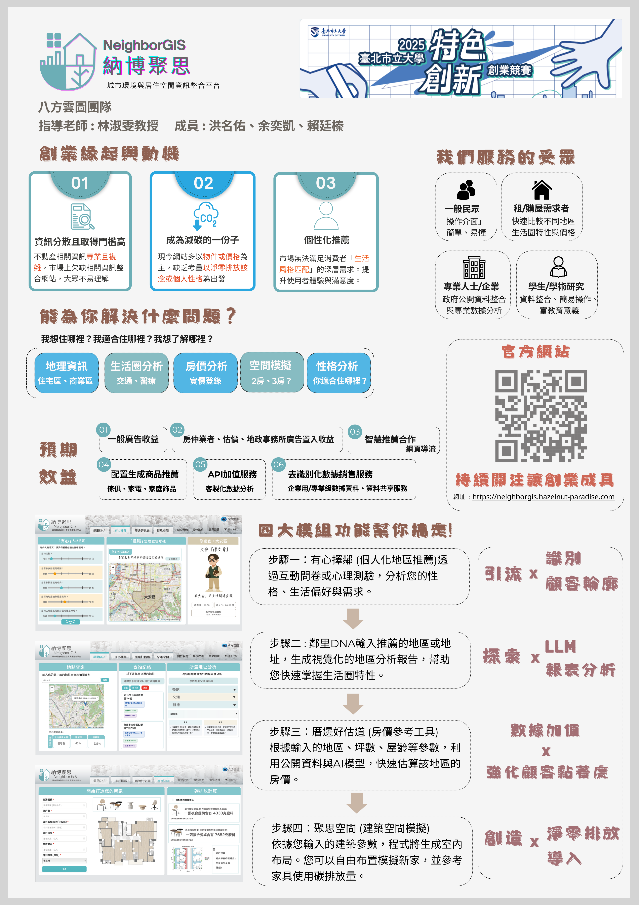

{.float-left width="300px"} 一位學習都市計畫與空間資訊領域的大學生，雖然常常出包，但仍然努力學習，並鑽研空間資訊， 目前所學習的知識包含ARCGIS、QGIS、R語言、Python、HTML、CSS、JavaScript等。將他們與空間規劃結合， 並應用於實際的規劃案例中。希望能夠在未來的學習和工作中，繼續提升自己的技能和知識，為城市規劃和空間資訊領域做出貢獻。 但其實我也會三維建模例如SKETCHUP等，在一些競賽中取得不錯的成果。

## 興趣介紹

GIS軟體：熟悉ARCGIS、QGIS等地理資訊系統軟體，能夠進行空間分析、地圖製作等工作。 資料視覺化 : 能夠使用R語言進行資料視覺化，並且熟悉ggplot2等相關套件。 視覺影像處理 : 使用Python進行影像處理，並且熟悉OpenCV、YOLOv8等相關套件。 前端網頁設計 : 熟悉HTML、CSS、JavaScript等前端技術，能夠設計和開發響應式網站。

::::: columns
::: {.column width="50%"}
## 我的技能

### GIS 軟體

熟悉軟體： ARCGIS、QGIS <br> 核心能力： 空間分析、地圖製作、數據處理
:::

::: {.column width="50%"}
## 

### 資料視覺化

熟悉語言： R <br> 核心套件： ggplot2、plotly
:::
:::::

::::: columns
::: {.column width="50%"}
### 視覺影像處理

熟悉語言： Python <br> 核心套件： OpenCV、YOLOv8
:::

::: {.column width="50%"}
### 前端網頁設計

熟悉技術： HTML、CSS、JavaScript <br> 核心能力： 響應式網站設計與開發
:::
:::::

## 台北探索校內專題

{width="586"}

[應用GIS探討不同社會經濟族群的空間不平等 — 以公園用地為例](https://utsus.utaipei.edu.tw/p/404-1112-119743.php?Lang=zh-tw) </iframe>

## 北市大創新創業競賽第二名

建構納博聚思空間不動產資訊整合平台創業提案，本次提案結合了不動產、空間資訊， 透過串接後端API實現環域分析，透過open street map提供豐富之POI地理資訊，並結合前端網頁設計， 提供使用者友善的操作介面，讓使用者能夠輕鬆查詢鄰里相關資訊。<br><br> [{width="586"}](https://neighborgis.hazelnut-paradise.com/)

[網站連結](https://neighborgis.hazelnut-paradise.com/)

## 台北生命故事暨健康科技園區

（臺北市政府青年局113年度公共政策創意提案暨辯論競賽）入圍決賽



<hr>

## 萬華茶室老街再生計畫

2024年電腦輔助設計之寒假作業。由於茶室文化老街的興衰，有感於此特別保留西園路之巴洛克式街廓， 讓老街的傳統風華再現，參照實際街景製作而成 

#### 鄰里居住偏好調查問卷:

::: pdf-container
<iframe src="https://docs.google.com/forms/d/e/1FAIpQLSdA-XPB5ZgCWIlkdcIQVrEV6Ac2IPt-nQg7anlarZp7uxnbLA/viewform?embedded=true" width="640" height="500" frameborder="0" marginheight="0" marginwidth="0">

載入中…

</iframe>
:::

<button id="download-button">

下載履歷

</button>

```{=html}
<script>
  const downloadButton = document.getElementById('download-button');
  downloadButton.addEventListener('click', () => {
    window.open('CV.pdf', '_blank');
  });
</script>
```
