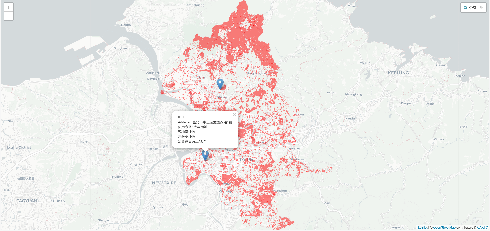
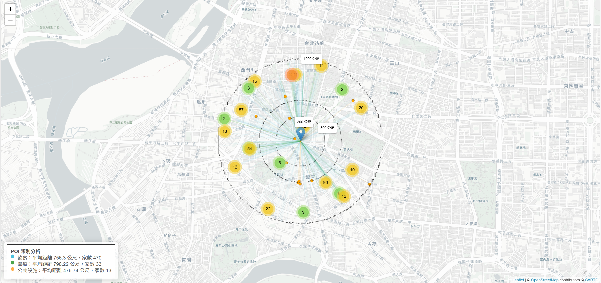

以下是我歷年來的作品，包含資料視覺化、專題報告、競賽提案、空間規劃設計等，歡迎參考！

::: talk-item
## 公有土地與資料視覺化

**內容說明：** 使用 R 語言進行撰寫迴圈讀取公有土地資料KML進行視覺化練習。   **連結：** [點此觀看](http://rpubs.com/min_jhfdo/1301288)

:::

::: talk-item
## 學校周遭POI分布地圖

**內容說明：** 使用 R 語言引用OSM API獲取特定地點周遭POI興趣點，。   **連結：** [點此觀看](http://rpubs.com/min_jhfdo/1301288)

:::

::: talk-item
## 台北探索校內專題

**專題名稱：** 應用GIS探討不同社會經濟族群的空間不平等 — 以公園用地為例   **連結：** [點此觀看](https://utsus.utaipei.edu.tw/p/404-1112-119743.php?Lang=zh-tw)

:::

::: talk-item
## 北市大創新創業競賽第二名

**提案名稱：** 建構納博聚思空間不動產資訊整合平台創業提案   **提案內容：** 結合不動產、空間資訊，透過串接後端API實現環域分析，提供使用者友善的操作介面。   **網站連結：** [點此進入](https://neighborgis.hazelnut-paradise.com/)

:::

::: talk-item
## 台北生命故事暨健康科技園區

**活動名稱：** 臺北市政府青年局113年度公共政策創意提案暨辯論競賽（入圍決賽）   **影片連結：**  
:::

::: talk-item
## 萬華茶室老街再生計畫

**專案內容：** 2024年電腦輔助設計之寒假作業，參照實際街景製作而成。   **影片連結：**  
:::

::: talk-item
## 校內活動

**擔任職位：** 城發系學會教學組講師   **活動內容：** 負責教學弟妹PS、AI、QGIS等軟體操作，並自製教材，協助學弟妹提升設計技能。
:::
