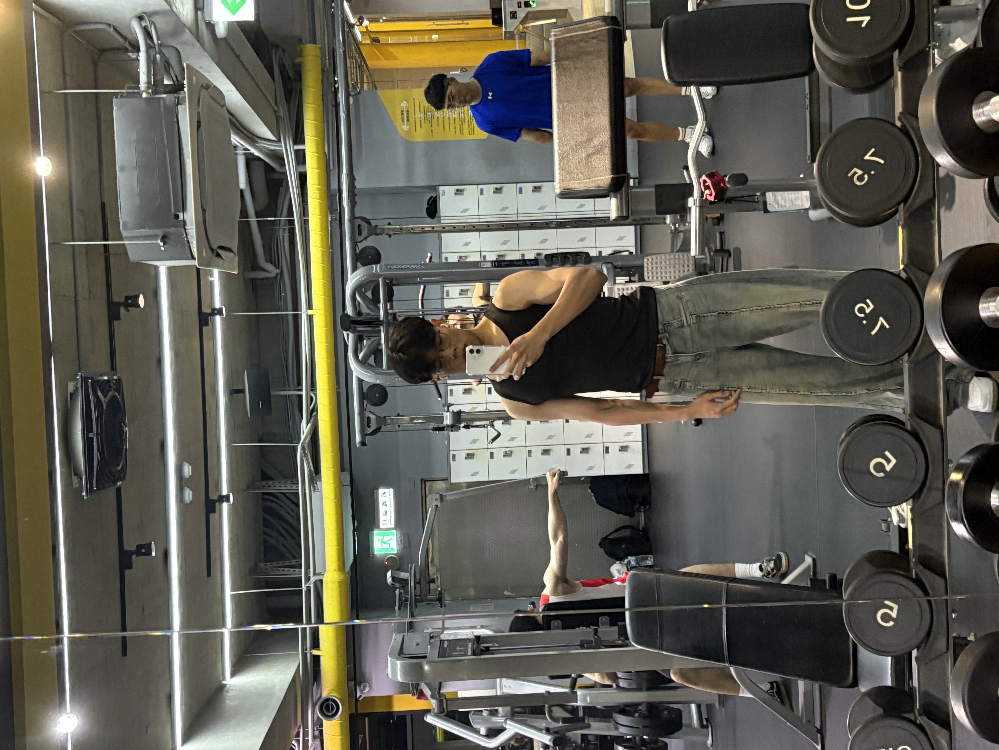
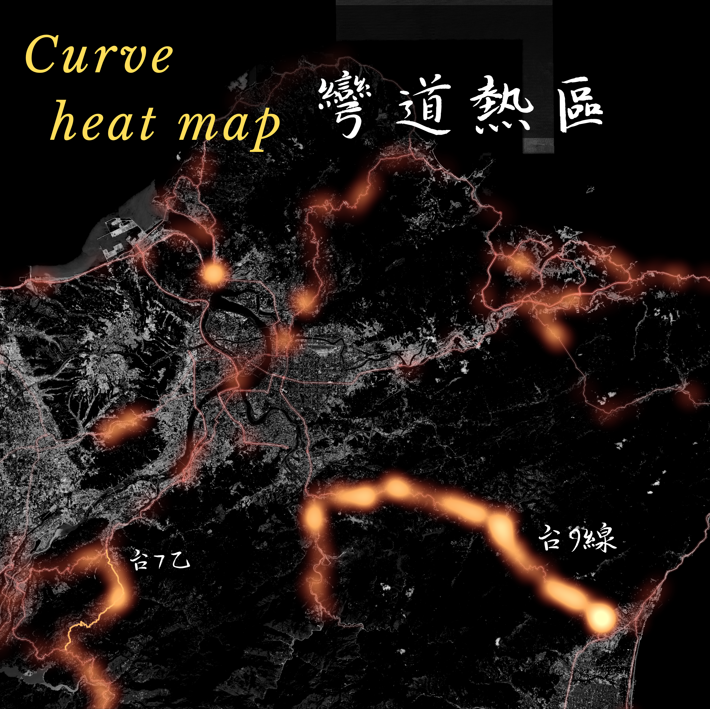
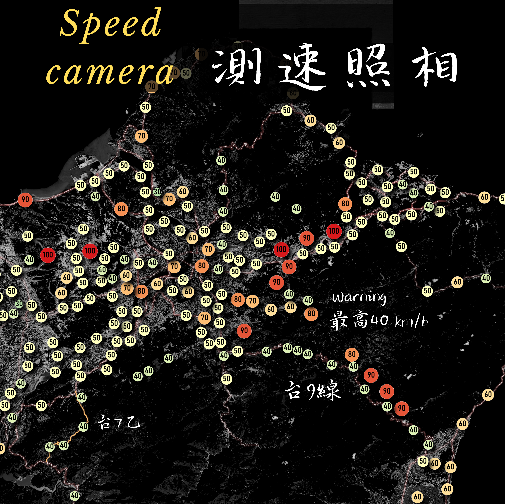
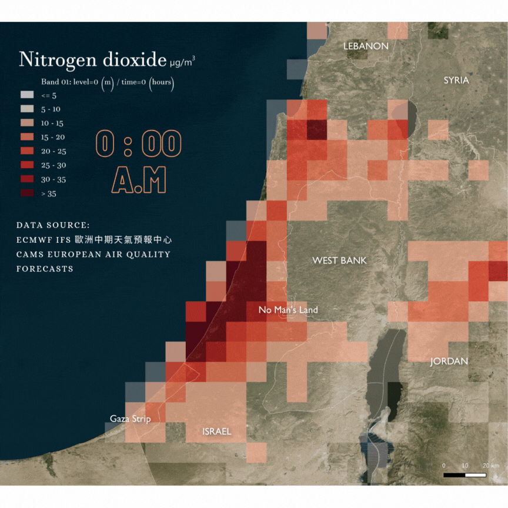
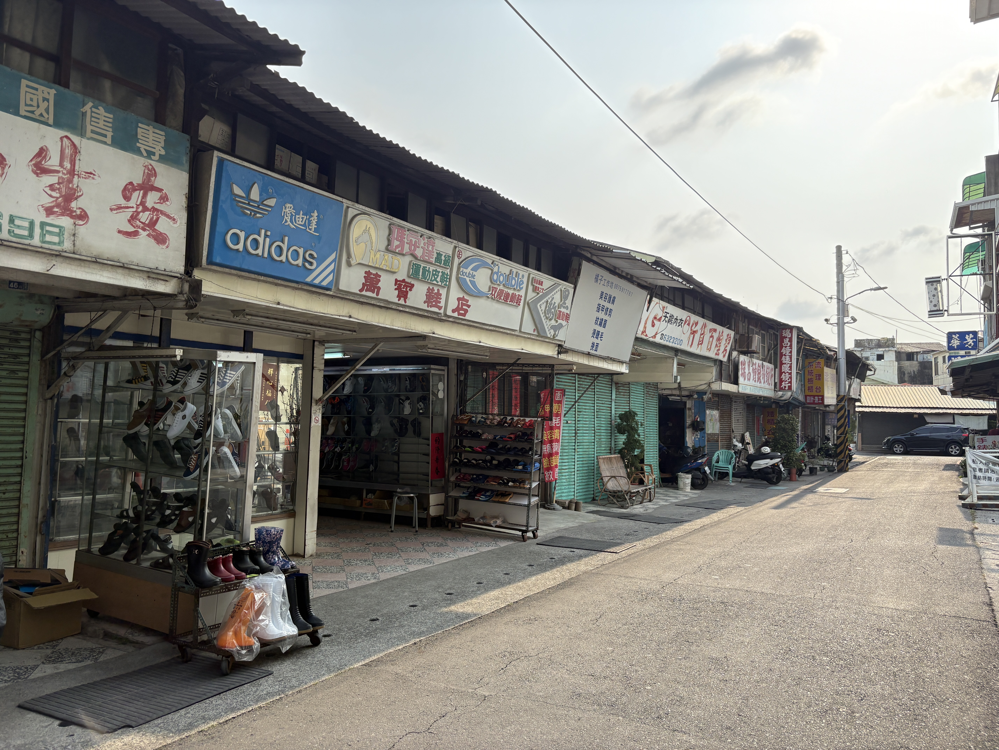

## 我來自的學校

:::::: r-stretch
::: {.column width="45%"}
  **台北市立大學：**

-   我們有兩個校區，天母和博愛校區，城發系在天母，有點偏僻
    
 

**我的科系：**

-   就讀城市發展學系，主要專業是城市規劃與地理資訊系統 (GIS)，目前為大三學生
    

-   雖然我們核心不是測量但是在規劃過程中經常用到GIS，有了這項工具後能讓我事半功倍 ，比起每張圖都熬夜加班進到繪圖軟體描繪快了許多。
    

:::

::: {.column width="10%"}
:::

::: {.column width="45%"}
  
:::
::::::

------------------------------------------------------------------------

## 關於我 About me

 

::::: r-stretch
::: {.column width="60%"}
**興趣：**

-   最喜歡的事情是。
    -   騎著BWS 125跑山，享受風景和速度。
    -   喜歡建築模型但是美術不行。
    -   喜歡研究都市，喜歡探索不同的城市和文化。
-   平常活動 打羽球、籃球、不愛看書。
-   喜歡的音樂 電音、Hip-hop。
-   飲食習慣 挑食不吃豬、喜歡吃辣。

**嗜好：**

-   旅遊，有空就會往外縣市跑或者國外
-   健身，通常在學校健身房、板橋三劍客
:::

::: {.column width="40%"}
{fig-align="center" height="800"}
:::
:::::

------------------------------------------------------------------------

## 當興趣遇到GIS

:::::: r-stretch
::: {.column width="60%"}
 

**因為跑山而認識 DEM?**

-   這個興趣源自於我喜歡跑山，大一時騎著BWS發現跑山的時候會有很多測速照相。於是我就開始研究跑山路線，因為測速照相太多，從而透過DEM評估公路系統的坡度、測速照相點位等特性，進而了解哪裡適合跑山，並且是安全的。
-   最初透過以QGIS建立跑山模型，然後加上套疊製作台七乙跑山路線圖，並且透過插件製作跑山路線的3D視覺化。 這個興趣讓我開始關注GIS領域，後面則製作更多自己的小研究。   {fig-align="center" width="40%"}我的機車BWS 125
:::

::: {.column width="5%"}
:::

::: {.column width="35%"}
{fig-align="center" width="72%"} {fig-align="center" width="72%"}
:::
::::::

------------------------------------------------------------------------

## 目前關注的方向

::::: r-stretch
::: {.column width="55%"}
  **透過遙測影像監測以色列開戰時的SO2**

-   例如砲擊可能產生SO2等氣體，覺得這項技術超酷還可跟國際時事結合，不用只看新聞才知道。

**公園綠地公平性**

-   這個研究是我大三時的專題，主要是透過GIS分析不同社經族群的公園綠地公平性，並且提出改善建議。

**萬華街區的建模**

-   2024年電腦輔助設計之寒假作業。由於茶室文化老街的興衰，有感於此特別保留西園路之巴洛克式街廓， 讓老街的傳統風華再現，參照實際街景製作而成。
:::
::: {.column width="5%"}
::: 
::: {.column width="40%"}
{fig-align="center" height="800"} ex 以色列開戰時的SO2
:::
:::::

------------------------------------------------------------------------

## 願景

::::: r-stretch
::: {.column width="55%"}
  **希望來這裡能學到什麼 ?**

-   自己喜歡模型，也希望能把這套三維圖資作業方式弄懂，從數據生成到圖資如何應用
-   向大家還有實習生多加學習，保持積極向上的工作態度
-   雖然我們系學了很多都市更新的知識，多數人談論價格與能夠分回多少坪數，卻沒人關注即將被拆掉的建築物。自己是個念舊的人，三維點雲可以保留都市風采和紋理，期許來到這邊好好學習這項技術 !
:::

::: {.column width="40%"}
{fig-align="center" height="800"} ex 台南荒廢的西市場
:::

 
:::::

------------------------------------------------------------------------

## 感謝聆聽 !

::: r-stretch
{fig-align="center" height="800"}
:::
